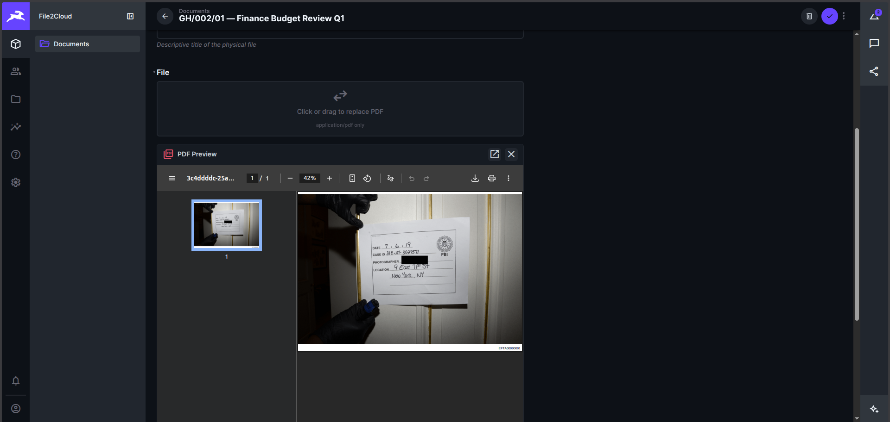

# directus-extension-pdf-viewer

A **Directus interface extension** that replaces the plain file-upload field with a full PDF experience — drag-and-drop upload, live progress bar, and an inline PDF preview — all inside the item edit form.

**Author:** Prince Panfoh
**GitHub:** [Keyboard-Presser](https://github.com/Keyboard-Presser)
**License:** MIT
**Directus compatibility:** `^10.10.0`

---

## Screenshots

### Inline PDF preview with toolbar


> The extension renders an inline PDF preview directly inside the Directus item form, with a toolbar for opening in a new tab or removing the file.

---

## Features

| Feature | Detail |
|---|---|
| Drag & drop | Drop a PDF anywhere on the upload zone |
| Click to upload | Click zone opens file picker, PDF only |
| Live progress | Upload progress % shown in real time |
| Inline preview | Full-height iframe renders the PDF inside the form |
| Open in new tab | Toolbar button opens the raw PDF in a new browser tab |
| Remove file | Toolbar button clears the field value |
| Auth-aware | Appends `?access_token=` automatically for private Directus instances |
| Theme-aware | Uses Directus CSS variables — works with light and dark themes |
| PDF-only guard | Rejects non-PDF files before upload with a clear error message |

---

## Installation

### Option A — npm (recommended)

```bash
npm install directus-extension-pdf-viewer
```

Then restart Directus. The extension is auto-discovered.

### Option B — manual

1. Download or clone this repo.
2. Copy the `dist/` folder and `package.json` into your Directus extensions folder:

```
your-directus-project/
└── extensions/
    └── directus-extension-pdf-viewer/
        ├── dist/
        │   └── index.js
        └── package.json
```

3. Restart Directus.

---

## Usage

1. Open **Settings → Data Model** in Directus.
2. Select the collection you want to add the PDF field to.
3. Add a new field of type **UUID** or **String**.
4. Under **Interface**, choose **PDF Viewer**.
5. Save the field. The field now renders as a PDF upload + preview in the item form.

> **Tip:** This extension is designed for file-reference fields (UUID pointing to `directus_files`). It calls `POST /files` internally and stores the resulting file UUID in the field value.

---

## Development

```bash
# Clone
git clone https://github.com/Keyboard-Presser/directus-extension-pdf-viewer.git
cd directus-extension-pdf-viewer

# Install dependencies
npm install

# Build
npm run build

# Watch mode (rebuilds on save)
npx directus-extension build --watch
```

### Project structure

```
src/
├── index.js        # Extension manifest (id, name, icon, types)
└── interface.vue   # Vue 3 component — upload zone + PDF iframe
dist/
└── index.js        # Compiled output (committed for npm installs)
```

### Key design decisions

- **No external PDF library** — the browser's native PDF renderer (via `<iframe>`) is used. Zero extra dependencies, works on Chrome, Edge, Firefox, and Safari.
- **Auth token injection** — the `pdfSrc` computed property reads the token from `api.defaults.headers` so private Directus assets render correctly without an extra login.
- **Scoped styles only** — all CSS uses Directus design tokens (`--theme--*` variables) so the component looks native in any theme.

---

## Changelog

See [CHANGELOG.md](CHANGELOG.md).

---

## License

MIT © 2026 Prince Panfoh
